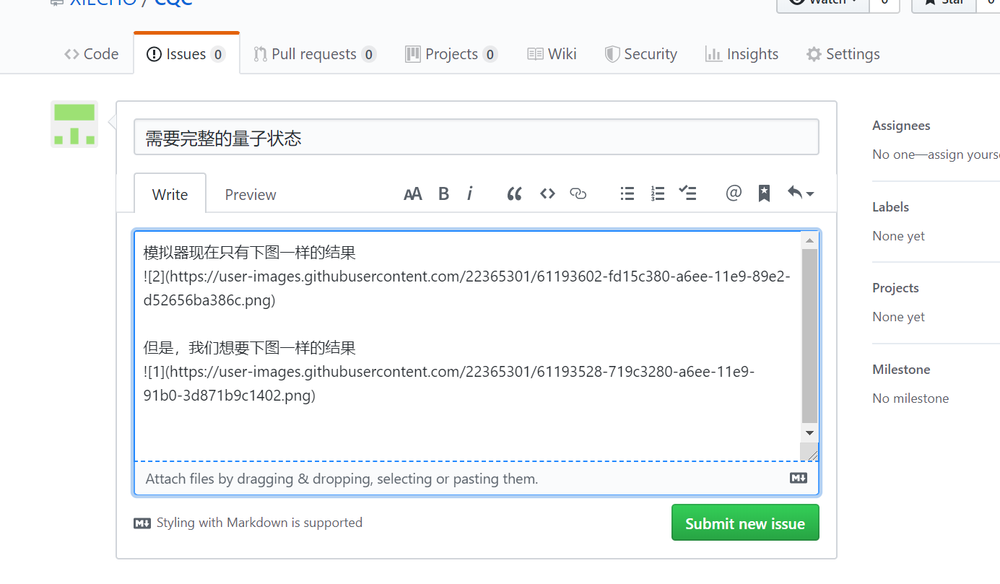

# 链接
http://192.168.120.33:1337/#/homepage

# 怎么使用

可以查看CQC说明文档.docx

# issues（提交你发现的问题以及bug）

step1: 点击上方的issues按钮

step2: 创建新的issue

step3: 填写内容

> tips: 1. 如果需要添加图片，直接将截图拖进提交内容的编辑框 2. 可以@XIECHO， 这样我能很快知道回复你
